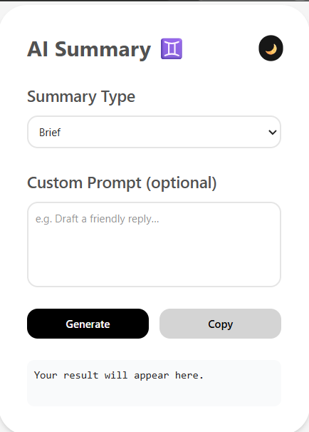

<p align="center">
  
</p>

# **Snapnote** - AI Summary Chrome Extension

A feature-rich Chrome extension that leverages Google Gemini to generate summaries or AI-driven responses based on either selected text or full-page content. It supports custom prompts, light/dark theming, and easy configuration of your Gemini API key.

---

## 🔥 Features

- **Selection-Aware Summarization**: Highlights text on any webpage and uses it as the input context.
- **Full-Page Fallback**: If no text is selected, the extension falls back to summarizing the entire article (all `<p>` or `<article>` contents).
- **Custom Prompt Input**: Enter your own prompt (e.g., “Draft a LinkedIn reply…”) for flexible AI tasks beyond summarization.
- **Light / Dark Theme Toggle**: Switch between light and dark modes; your preference is saved and persisted.
- **Copy to Clipboard**: One-click copy of the generated summary or response.
- **Persistent API Key**: Store your Gemini API key in Options and never re-enter it.

---

## Popup Box

<p align="center">
  
</p>

## 🛠 Installation & Setup

**Clone the repository**

```bash
git clone https://github.com/sschoudhary30/AI-Summary-chrome-extension.git
```

Install Tailwind CLI (if not already):

```bash
npm install -g tailwindcss@latest postcss@latest autoprefixer@latest
```

Build the Tailwind CSS
Run the build command to generate output.css from your input.css:

bash

```
npx tailwindcss -i ./input.css -o ./output.css --minify
```

Important: Re-run this command after every change to your Tailwind source (input.css or tailwind.config.js).

**Preload Tailwind via options.html**

**_Include the generated output.css in options.html. Since Manifest V3 loads options.html first at install/upgrade, this ensures the stylesheet is cached and instantly available in popup.html and content scripts. Without this step, Tailwind classes may not render properly in your popup._**

##🚀 Usage

##Generate a summary or response
Choose a Summary Type (Brief, Detailed, Bullet) or enter your own Custom Prompt.
Press Generate to fetch the AI response.

##⚙️ How It Works
###Tailwind Preloading: The options.html page (loaded at install/upgrade) caches output.css so the popup and content scripts never flash unstyled content. This step is critical: without preloading, Tailwind styles won’t apply in your popup.
Shadow-DOM Sandboxing: All popup UI is rendered inside a Shadow Root to ensure style isolation.###

✨ Customization & Development
Adjust Tailwind: Edit input.css or tailwind.config.js, then re-run the build command and reload the extension.

Modify Prompts: In popup.js, update the promptMap or logic to suit your needs.

Themes & Styling: Tailwind’s dark: variants control light/dark styling—feel free to tweak colors.

📄 License
MIT © suresh choudhary
